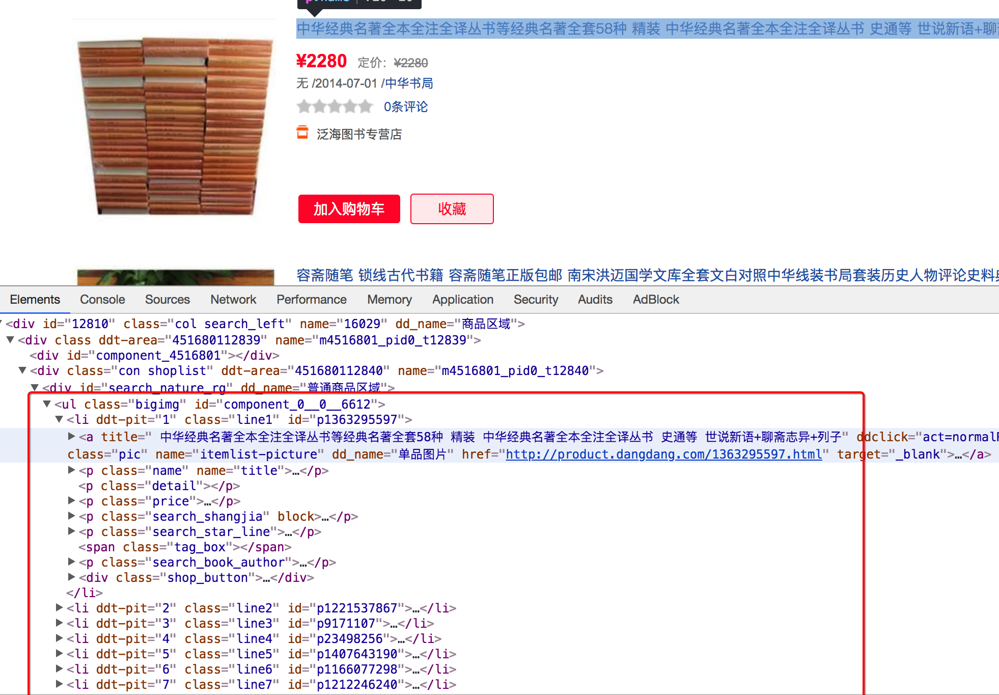
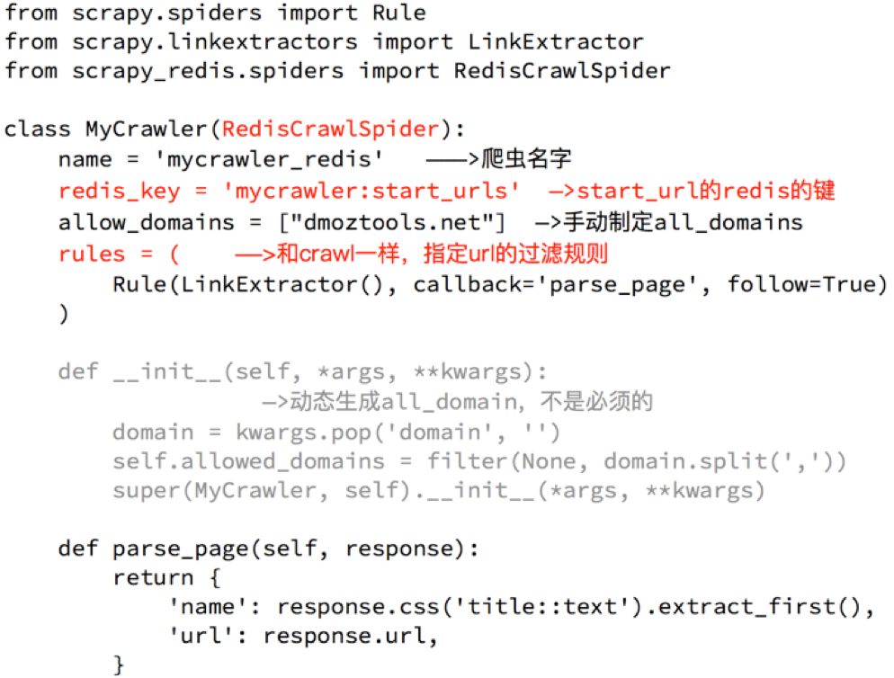

## scrapy_redis实现分布式爬虫

##### 学习目标
1. 能够应用 scrapy_redis实现分布式爬虫
2. 能够应用 scrapy_redis中RedisCrawlspider类实现分布式爬虫


---------------

### 1 RedisSpider

##### 1.1 分析demo中代码

> 打开example-project项目中的myspider_redis.py文件

通过观察代码：

1. 继承自父类为RedisSpider
2. 增加了一个redis_key的键，没有start_urls，因为分布式中，如果每台电脑都请求一次start_url就会重复
3. 多了`__init__`方法，该方法不是必须的，可以手动指定allow_domains
4. 启动方法：
    1. 在每个节点正确的目录下执行`scrapy crawl 爬虫名`，使该节点的scrapy_redis爬虫程序就位
    2. 在共用的redis中 `lpush redis_key 'start_url'`，使全部节点真正的开始运行


##### 1.2 动手实现当当图书爬虫
需求：抓取当当图书的信息

目标：抓取当当图书又有图书的名字、封面图片地址、图书url地址、作者、出版社、出版时间、价格、图书所属大分类、图书所属小的分类、分类的url地址

url：http://book.dangdang.com

##### 思路分析：

1. 程序的入口

    当当图书中，从大分类入手，还有一个中间分类，以及小分类，小分类对一个的地址就是列表页的地址
    
    注意，url地址的响应和elements略微不同，其中不是每个大分类都在a标签中，中间部分分类不在span标签中
    
    

2. 确定列表页的url地址和程序终止条件

    存在下一页
    
    

    不存在下一页
    
    

3. 确定数据的位置
    
    数据都在url地址对应的响应中，包括列表
    

4. 完善spider
    
    可以使用scrapy的方式创建爬虫，只需要把父类进行修改，添加redis_key
    
    同时在settings.py中进行配置
    

### 2. RedisCrawlSpider

##### 2.1 分析demo中的代码

> 打开example-project项目中的mycrawler_redis.py文件 

通过观察代码：

1. 继承自父类为RedisCrwalSpider
2. 也是增加了一个redis_key的键，没有start_urls
3. 一样多了init方法，该方法不是必须的，可以手动指定allow_domains 
4. 启动方法：
    1. 在每个节点正确的目录下执行`scrapy crawl 爬虫名`，使该节点的scrapy_redis爬虫程序就位
    2. 在共用的redis中 `lpush redis_key 'start_url'`，使全部节点真正的开始运行




##### 2.2   动手完成亚马逊图书爬虫
需求：抓取亚马逊图书的信息

目标：抓取亚马逊图书又有图书的名字、封面图片地址、图书url地址、作者、出版社、出版时间、价格、图书所属大分类、图书所属小的分类、分类的url地址

url：https://www.amazon.cn/%E5%9B%BE%E4%B9%A6/b/ref=sd_allcat_books_l1?ie=UTF8&node=658390051

##### 思路分析：

1. 确定rule中的规则

    可以通过连接提取器中的restrict_xpath来实现url地址的，不需要定位到具体的url地址字符串，定位到准确的标签位置即可
    
    注意：定位到的标签中不能包含不相关的url，否则请求不相关的地址后，数据提取会报错
    
    通过分析大分类和小分类的url地址，发现他们的规则仙童，即一个Rule可以实现从大分类到小分类的到列表页的过程
    
    1. 大分类url地址
    
        
    
    2. 小分类url地址
    
        
    
    3. 列表页翻页的url地址位置
    
        
     
    4. 进入详情页翻页的url地址位置
    
        详情页在h2标签的上一级，定位到h2后，通过`..`即可实现获取该url
        
        
     
2. 详情页数据的抓取

    在详情页中，数据有两种，一种是电子书的信息，一种是纸质书的信息，两种页面，数据位置不同
    
    1. 确定书的分类，是电纸书还是纸质书

        电子书
        
        
        
        纸质书
        

    2.  不同类型的书籍分别写xpath，比如价格的提取

3. 在settings中进行相应的配置


--------------------

### 小结     
1. 实现RedisSPider类爬虫：
    1. 继承RedisSpider类
    2. 增加了一个redis_key的键，没有start_urls
    3. 手动指定allow_domains=[], 删除__init__方法
2. 实现RedisCrawlspider类爬虫：
    1. 继承RedisCrawlspider类
    2. 增加了一个redis_key的键，没有start_urls
    3. 手动指定allow_domains=[], 删除__init__方法
    4. 完善rules规则
3. settings.py的配置：
    ```
    #指定了去重的类
    DUPEFILTER_CLASS = "scrapy_redis.dupefilter.RFPDupeFilter"
    #制定了调度器的类
    SCHEDULER = "scrapy_redis.scheduler.Scheduler"
    #调度器的内容是否持久化
    SCHEDULER_PERSIST = True
    #redis的url地址
    REDIS_URL = "redis://127.0.0.1:6379"
    ```
4. RedisSPider和RedisCrawlspider爬虫的启动方法：
    1. 在每个节点正确的目录下执行`scrapy crawl 爬虫名`，使该节点的scrapy_redis爬虫程序就位
    2. 在共用的redis中 `lpush redis_key 'start_url'`，使全部节点真正的开始运行

        
    
### 参考代码
        
book/spiders/dangdang.py
```
import scrapy
from scrapy_redis.spiders import RedisSpider
from copy import deepcopy


class DangdangSpider(RedisSpider):
    name = 'dangdang'
    allowed_domains = ['dangdang.com']
    info_str = '[ *] 如果需要启动amazon爬虫，请在配置的redis中执行：\n lpush dangdang "http://book.dangdang.com/" \n[ *] 请输入任意继续执行本程序'
    input(info_str)
    # start_urls = ['http://book.dangdang.com/']
    # lpush dangdang 'http://book.dangdang.com/'
    redis_key = "dangdang"

    def parse(self, response):
        #获取大分类分组
        div_list = response.xpath("//div[@class='con flq_body']/div")[1:-1]
        for div in div_list:
            item = {}
            #大分类的名字
            item["b_cate"] = div.xpath(".//dl[contains(@class,'primary_dl')]/dt//text()").extract()
            #获取中间分类的分组
            dl_list = div.xpath(".//dl[@class='inner_dl']")
            for dl in dl_list:
                #中间分类的名字
                item["m_cate"] = dl.xpath("./dt//text()").extract()
                #获取小分类的分组
                a_list = dl.xpath("./dd/a")
                for a in a_list:
                    #小分类的名字
                    item["s_cate"] = a.xpath("./text()").extract_first()
                    item["s_href"] = a.xpath("./@href").extract_first()
                    #发送小分类URL地址的请求，达到列表页
                    yield scrapy.Request(
                        item["s_href"],
                        callback=self.parse_book_list,
                        meta = {"item":deepcopy(item)}
                    )

    def parse_book_list(self,response): #提取列表页的数据
        item = response.meta["item"]
        #获取列表页图书的分组
        li_list = response.xpath("//ul[@class='bigimg']/li")
        for li in li_list:
            item["book_name"] = li.xpath("./a/@title").extract_first()
            item["book_href"] = li.xpath("./a/@href").extract_first()
            item["book_author"] = li.xpath(".//p[@class='search_book_author']/span[1]/a/text()").extract()
            item["book_press"] = li.xpath(".//p[@class='search_book_author']/span[3]/a/text()").extract_first()
            item["book_desc"] = li.xpath(".//p[@class='detail']/text()").extract_first()
            item["book_price"] = li.xpath(".//span[@class='search_now_price']/text()").extract_first()
            item["book_store_name"] = li.xpath(".//p[@class='search_shangjia']/a/text()").extract_first()
            item["book_store_name"] = "当当自营" if item["book_store_name"] is None else item["book_store_name"]
            yield item

        #实现列表页翻页
        next_url = response.xpath("//li[@class='next']/a/@href").extract_first()
        if next_url is not None:
            #构造翻页请求
            yield response.follow(
                next_url,
                callback = self.parse_book_list,
                meta = {"item":item}
            )
```

book/spiders/amazon.py
```
import scrapy
from scrapy.linkextractors import LinkExtractor
from scrapy.spiders import CrawlSpider, Rule
from scrapy_redis.spiders import RedisCrawlSpider
import re


class AmazonSpider(RedisCrawlSpider):
    name = 'amazon'
    allowed_domains = ['amazon.cn']
    info_str = '[ *] 如果需要启动amazon爬虫，请在配置的redis中执行：\n lpush amazon "https://www.amazon.cn/%E5%9B%BE%E4%B9%A6/b/ref=sd_allcat_books_l1?ie=UTF8&node=658390051" \n[ *] 请输入任意继续执行本程序'
    input(info_str)
    # start_urls = ['https://www.amazon.cn/%E5%9B%BE%E4%B9%A6/b/ref=sd_allcat_books_l1?ie=UTF8&node=658390051']
    # lpush amazon 'https://www.amazon.cn/%E5%9B%BE%E4%B9%A6/b/ref=sd_allcat_books_l1?ie=UTF8&node=658390051'
    redis_key = "amazon"

    rules = (
        #实现提取大分类的URL地址,同时提取小分类的url地址
        Rule(LinkExtractor(restrict_xpaths=("//ul[contains(@class,'a-unordered-list a-nostyle a-vertical s-ref-indent-')]/div/li",)), follow=True),
        Rule(LinkExtractor(restrict_xpaths=("//ul[@class='a-unordered-list a-nostyle a-vertical s-ref-indent-two']/div/li",)), follow=True),

        # 实现提取图书详情页的url地址
        Rule(LinkExtractor(restrict_xpaths=("//div[@id='mainResults']/ul/li//h2/..",)), callback="parse_item"),
        #实现列表页的翻页
        Rule(LinkExtractor(restrict_xpaths=("//div[@id='pagn']//a",)),follow=True),
    )

    def parse_item(self, response):
        item = {}
        item["book_name"] = response.xpath("//span[contains(@id,'roductTitle')]/text()").extract_first()
        item["book_author"] = response.xpath("//div[@id='bylineInfo']/span[@class='author notFaded']/a/text()").extract()
        item["book_press"] = response.xpath("//b[text()='出版社:']/../text()").extract_first()
        item["book_cate"] = response.xpath("//div[@id='wayfinding-breadcrumbs_feature_div']/ul/li[not(@class)]//a/text()").extract()
        item["book_url"] = response.url
        item["book_desc"] = re.findall(r"\s+<noscript>(.*?)</noscript>\n  <div id=\"outer_postBodyPS\"",response.body.decode(),re.S)[0]
        # item["book_img"] = response.xpath("//div[contains(@id,'img-canvas')]/img/@src").extract_first()
        item["is_ebook"] = "Kindle电子书" in response.xpath("//title/text()").extract_first()
        if item["is_ebook"]:
            item["ebook_price"] = response.xpath("//td[@class='a-color-price a-size-medium a-align-bottom']/text()").extract_first()
        else:
            item["book_price"]= response.xpath("//span[contains(@class,'price3P')]/text()").extract_first()

        yield item
```

book/pipelines.py
```
import re

class DangDangPipeline(object):
    def process_item(self, item, spider):
        if spider.name == "dangdang":
            item["b_cate"] = "".join([i.strip() for i in item["b_cate"]])
            item["m_cate"] = "".join([i.strip() for i in item["m_cate"]])
            print(item)
        return item


class AmazonPipline:
    def process_item(self,item,spider):
        if spider.name == "amazon":
            item["book_cate"] = [i.strip() for i in item["book_cate"]]
            item["book_desc"] = item["book_desc"].split("<br><br>")[0].split("<br>")
            item["book_desc"] = [re.sub("<div>|</div>|<em>|</em>|\s+|\xa0|<p>|</p>","",i) for i in item["book_desc"]]
            print(item)
        return item
```

book/settings.py
```
BOT_NAME = 'book'

SPIDER_MODULES = ['book.spiders']
NEWSPIDER_MODULE = 'book.spiders'

# LOG_LEVEL = "WARNING"

#指定了去重的类
DUPEFILTER_CLASS = "scrapy_redis.dupefilter.RFPDupeFilter"

#制定了调度器的类
SCHEDULER = "scrapy_redis.scheduler.Scheduler"

#调度器的内容是否持久化
SCHEDULER_PERSIST = True

#redis的url地址
REDIS_URL = "redis://127.0.0.1:6379"

USER_AGENT = 'Mozilla/5.0 (Macintosh; Intel Mac OS X 10_13_4) AppleWebKit/537.36 (KHTML, like Gecko) Chrome/66.0.3359.139 Safari/537.36'

ROBOTSTXT_OBEY = False

ITEM_PIPELINES = {
   'book.pipelines.DangDangPipeline': 300,
   'book.pipelines.AmazonPipline': 400,
}
```