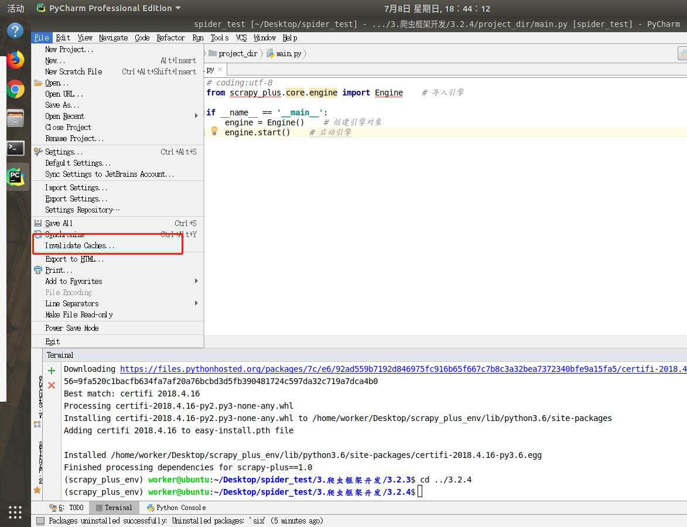
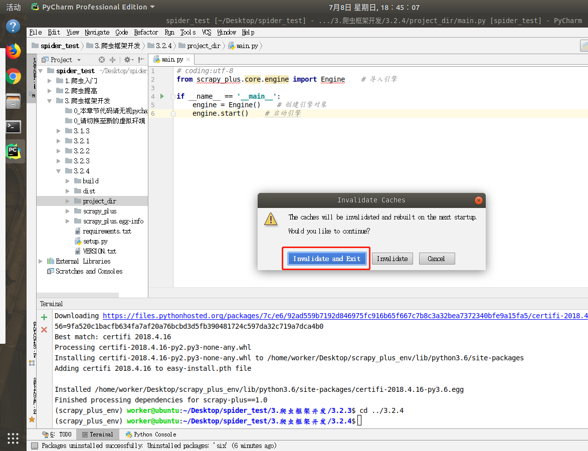

## 框架运行 -- `main.py`

##### 目标
1. 熟悉框架的执行过程
2. 掌握框架的启动方法

----

### 1. 编写`main.py`
新在其他路径下创建一个项目文件夹 project_dir

```python
# project_dir/main.py

from scrapy_plus.core.engine import Engine    # 导入引擎

if __name__ == '__main__':
    engine = Engine()    # 创建引擎对象
    engine.start()    # 启动引擎
```

运行结果：管道中打印的item对象

```
item对象:<scrapy_plus.item.Item object at 0x10759eef0>
```

### 2. 清除pycharm缓存并重启

> 运行main.py时会报错，是因为pycharm没有反应过来，此时需要对pycharm清除缓存

##### 2.1 点击File-->Invalidate Caches...



##### 2.2 点击Invalidate and Exit



##### 2.3 重新打开pycharm并运行main.py

----

### 小结
掌握框架的启动方法


